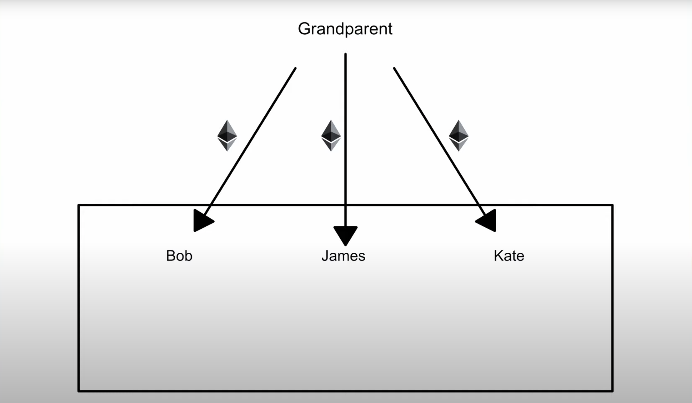

# Smart-Contract-in-Solidity
There I show example how to create smart contract in solidity programming language

# Run
You can run smart contract's codes in [here](https://remix.ethereum.org/#optimize=false&runs=200&evmVersion=null&version=soljson-v0.8.7+commit.e28d00a7.js)

# Scenario

